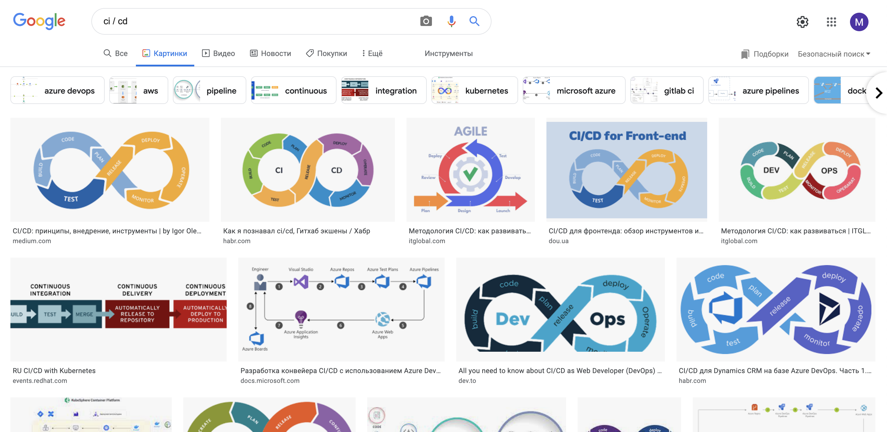
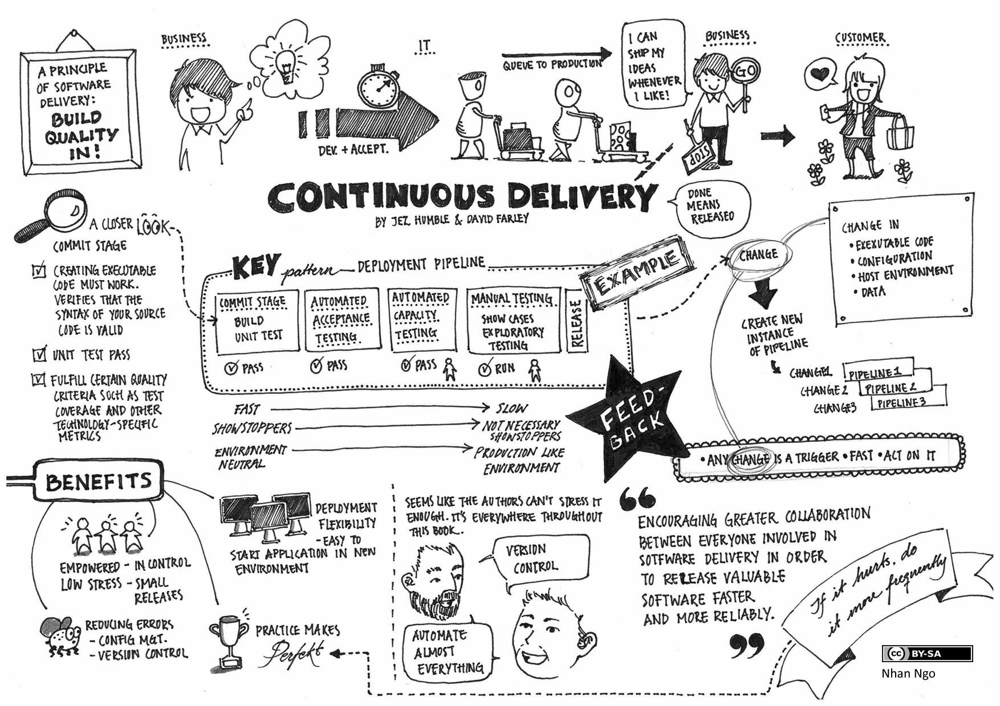
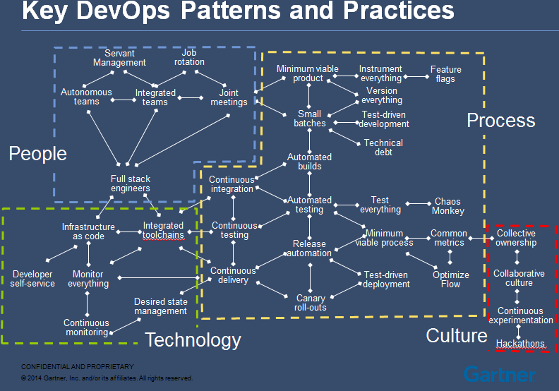

CI / CD

0. Когда гуглишь что такое CI / CD 
	

1. С чего всё начинается в нашей работе? 
	С денег. Бизнесу нужны деньги. Бизнес хочет быстро поставлять фичи, дешевле (по ресурсам/ репутации) их обкатывать. 
   	
2. Как было раньше? 
	На заре был waterfall: рынок менялся не так быстро, компании могли позволить себе долгие итерации, игроков на рынке было мало. 

3. [Waterfall](./waterfall.md)

4. А что же всё-таки такое CI / CD? 

	Это набор практик для гибкой разработки. Это процесс. 
   (CD - всё, что связано с выкладкой; CI - всё, что связано с кодом)

	Рассказать о разнице между CI/CD сервером и CI/CD процессом. 

	Что такое CI? 
	CI - средство коммуникации, средство развития кода, а точнее поддержки развития архитектуры, которое сигнализирует команде о развитии кодовой базы в определенном направлении, которое, потенциально, может привести к нежелательным последствиям.
   	CI это про, то все разработчики живут в одной реальности, где реальностью является их общая кодовая база, поэтому им надо часто (в конце каждого рабочего дня, чем чаще - тем лучше), вливать свои изменения в общую ветку кода или подтягивать её в свою ветку кода из общей, чтобы в дальнейшем избежать тяжелых, конфликтных мержей. Отсюда и декомпозиция задач, чтобы ветки с фичами не жили дольше дня, тогда получится часто вливаться / стягивать общую ветку, в этом и суть Continious Integration

	Что такое CD? Delivery / deployment 
   
	[Хорошие практики](./best-practices.md). 

	[О тестировании в CI](./testers-part.md) 

	Как понять, есть у вас CI/CD или ещё нет? 

	Не CI/CD единым (слайд про связь процессов в компании) 
	

5. Зачем эта преза? 

	Новые воркфлоу CI/CD в гитхабе, документация к ним 

	Чтобы люди понимали, что CI/CD это не про гитхаб / тимсити / дженкинс, а про процессы 

	Чтобы люди понимали, что кроме CI нужно выстраивать смежные процессы, развивать инженерную культуру 