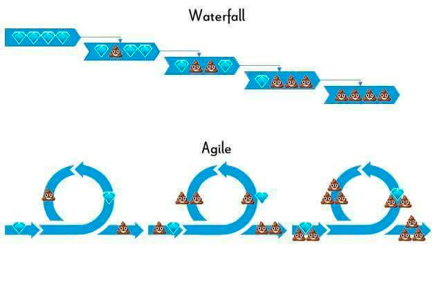

Что не так с waterfall-ом сейчас и в принципе? 
* waterfall норм в долгоиграющих проектах, типа постройки ракеты
* в случае выкатки инкремента CD работает лучше, нежели в случае выкатки большого изделия.
* Добавить экскурс в историю, рассказав про waterfall, его этап интеграции (гемор), его не выгодность бизнесу в текущих реалиях,  перед рассказом о CI.

Рассказать про этапы, неповоротливость этапов и процесса в целом. 

Где применим сейчас waterfall? 

Может ли быть CI/CD в рамках waterfall-а? 